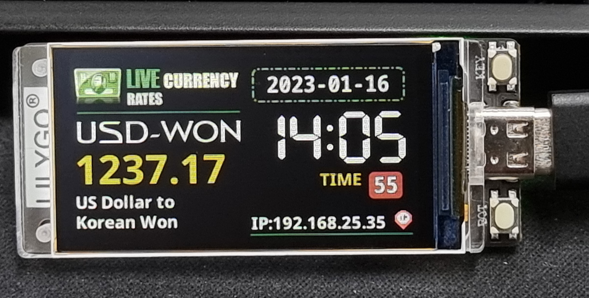

### TDisplayS3Currency 대한민국 환율용
https://github.com/VolosR/TDisplayS3Currency 에서 한국 시간과 USD 원화 환율로 변경한 코드입니다.



1. TFT-eSPI 라이브러리 변경하기

    먼저 아래의 링크를 참고해 아두이노 라이브러리의 TFT-eSPI를 변경해야합니다.
    https://blog.naver.com/chandong83/222975883432


2. 폴더명 변경하기
 혹시라도 폴더명이 TDisplayS3Currency_USD_KRW 나 TDisplayS3Currency_USD_KRW_main 라면 TDisplayS3Currency로 변경해주세요. 


3. 소스코드서 WIFI 공유기 설정 변경하기
 TDisplayS3Currency.ino 에서 아래의 내용을 자신의 WIFI 공유기 설정으로 변경해주세요.
    ```
    const char* ssid     = "*********";///EDIIIT
    const char* password = "*********";
    ```
